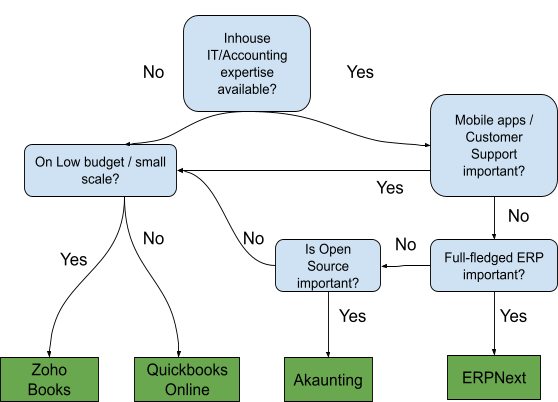

- [Executive Summary](#executive-summary)
- [Features of Financial Management System](#features-of-financial-management-system)
  - [Bookkeeping](#bookkeeping)
  - [Process Automation and 3rd Party Integration](#process-automation-and-3rd-party-integration)
  - [Reporting and Budgeting](#reporting-and-budgeting)
  - [Other Features](#other-features)
- [Decision Tree & Fast Mapping Table](#decision-tree--fast-mapping-table)
  - [NGO Characteristics Mapping Table](#ngo-characteristics-mapping-table)
- [Overview of Shortlisted Solutions](#overview-of-shortlisted-solutions)
  - [Comparison between SaaS and Open Source Platforms](#comparison-between-saas-and-open-source-platforms)
  - [Quickbooks Online](#quickbooks-online)
  - [Zoho books](#zoho-books)
  - [Quickbooks vs. Zoho Books Tier Based Comparison](#quickbooks-vs-zoho-books-tier-based-comparison)
  - [ERPNext](#erpnext)
  - [Akaunting](#akaunting)
- [Detail Evaluation of Solutions](#detail-evaluation-of-solutions)
  - [Criterias](#criterias)
    - [Software features](#software-features)
    - [Operating specifications](#operating-specifications)
    - [Customer support](#customer-support)
    - [Pricing](#pricing)
  - [Scoring](#scoring)
  - [Result Discussion](#result-discussion)

# Executive Summary
Action IT aims to present a core set of IT offerings for NGOs. Financial management systems are a key part of organisational infrastructure that is not widely available to small and medium NGOs. The purpose of this project is to better understand the requirements for such systems, and offer plausible options and example configurations or deployments of tools as part of Action IT core service.

Two solutions from SaaS (Software as a Service) platforms, as well as two solutions from open source platforms, has beend shortlisted for NGOs of different backgrounds. There is one SaaS solution for new startup NGOs with little IT and accounting knowledge. There is another SaaS solution suitable for medium and large scale NGOs. As for open source platforms, there is one option that can be expanded to an ERP1 solution with HR and volunteer management functionalities. Another open source option provides basic accounting features and allows for expansion by purchasing third party apps.

We have included a decision tree to assist NGOs in selecting an appropriate solution as well as an implementation summary for each recommended open source platform.

Note this report offers a general overview and evaluation of available financial management solutions. Data and information collected may vary over time and can be subjective. Clients are advised to use the recommendations as one of the many references available. Decisions on implementation should be made after clients’ own evaluation based on specific environments and requirements.

Key Takeaways include:
 - Features of Financial Management System Comparison of Software as a
 - Service (SaaS) and Open-Source Platform solutions Shortlisted
 - Financial Management Solutions

1ERP (Enterprise Resource Planning) is a solution that enables organizations to manage multi-disciplinary resources such as accounting, finance, human resources, vendors, sale & marketing.

# Features of Financial Management System
A financial management solution is a complex system that comprises a wide range of features.

## Bookkeeping
Bookkeeping is the basic capability to record and categorise transactions of revenues, expenses and capital expenditure:
-   Revenues - e.g. sales of goods and services, donations, funding or grants;
-   Expenses - e.g. utilities, rent, advertising;
-   Capital expenditure e.g. building, car, equipments

Bookkeeping also features the filing of support documents, with capability to capture, store documents (e.g. invoices and receipts) and reconcile with corresponding transactions.

## Process Automation and 3rd Party Integration
Process automation covers revenue collection, expense payment and the generation and transmitting of corresponding documents, e.g. invoices and receipts.

Revenue collection refers to the system’s mechanism to collect:
-   Donation & other sales proceeds;
-   Funding & grants from government, NGOs, businesses & philanthropic foundations

Expense payment refers to the calculation and execution of actual payments including:
-   Employee payroll, withholding tax, superannuation contributions;
-   Regular expenses (e.g. utility, rent);
-   Ad hoc expenses (e.g. campaign advertising); and
-   Financial aids to beneficiaries

Third party integration includes integration with payment gateway and bank accounts to facilitate aforementioned revenue collection and expense payments.

Generation and transmitting of accounting related documents such as customer invoices and receipts based on system setup eg. membership, monthly subscription and ad hoc donation.

## Reporting and Budgeting

Reporting covers a range of styles, standards and target audiences. The main areas include the following:
-   Internal management reports are for various operational purposes such as cash flow management, monthly reports for income and expenses. Internal reporting can be of static report format triggered by management request or be displayed in a real time visual dashboard;
-   External reports are targeted for advisory board, funding organisation, or general public review;
-   Accounting reports are required to meet local accounting / financial / auditor requirements and standards;
-   Taxation reports to meet taxation purpose

Budgeting, forecasting and project financing are important components of accounting to ensure a systematic way of managing an organization.

## Other Features
There are other features that are closely related to accounting and financial management of an NGO. These include:
-   Vendor management;
-   Inventory management;
-   Asset management;
-   Donor management;
-   Non-profit specific features (e.g. tax adjustments);
-   Multi-country support in terms of language, currency, regulations;
-   Volunteer management;
-   Project management

# Decision Tree & Fast Mapping Table

The decision tree below offers a quick way for NGOs to select an appropriate solution based on frequent questions and requirements raised.

## NGO Characteristics Mapping Table

A mapping table is also provided as an additional way for NGOs to verify if one solution is suitable based on the organization’s characteristics.

|                                        |          | Solution Suitability |            |         |           |
|----------------------------------------|----------|----------------------|------------|---------|-----------|
| NGO characteristic                     | Hold /   | Quickbooks Online    | Zoho Books | ERPnext | Akaunting |
|                                        | Not Hold |                      |            |         |           |
| Existing IT team                       | Hold     | Y                    | Y          | Y       | Y         |
|                                        | Not Hold | Y                    | Y          | N       | N         |
| Accounting Expertise                   | Hold     | Y                    | Y          | Y       | Y         |
|                                        | Not Hold | N                    | Y          | N       | Y         |
| > 500 employees                        | Hold     | Y                    | N          | Y       | N         |
|                                        | Not Hold | Y                    | Y          | Y       | Y         |
| Needs ongoing customer support         | Hold     | Y                    | Y          | N       | N         |
|                                        | Not Hold | Y                    | Y          | Y       | Y         |
| Requires mobile apps                   | Hold     | Y                    | Y          | N       | N         |
|                                        | Not Hold | Y                    | Y          | Y       | Y         |
| Requires ability to customize software | Hold     | N                    | N          | Y       | Y         |
|                                        | Not Hold | Y                    | Y          | Y       | Y         |
| On low budget/small scale              | Hold     | N                    | Y          | Y       | Y         |
|                                        | Not Hold | Y                    | Y          | Y       | Y         |
| Requires ERP system                    | Hold     | N                    | N          | Y       | Y         |
|                                        | Not Hold | Y                    | Y          | Y       | Y         |

# Overview of Shortlisted Solutions

Two solutions have been shortlisted for SaaS platforms and two solutions for open source platforms. A comparison between SaaS and open source platforms, summary of recommendations are provided below.

## Comparison between SaaS and Open Source Platforms

SaaS (Software as a Service) is a web-based solution hosted by a software company. Users access the service via browsers or mobile apps and pay a monthly or yearly subscription based on the service tier and number of users. On-premise installation and maintenance of software is not necessary. Additional hardware is also not normally required. SaaS solutions are usually turn-key solutions with intuitive user interfaces, requiring minimal customization effort. Hosting and security are usually taken care of.

Open source software is normally free to download and install. Users can view and modify its source code according to specific requirements. The software can be hosted on public clouds or on a local server. It is known for its flexibility and control. There is however associated hardware or hosting cost, requirement on inhouse IT staff for coding, implementation, customization, security setup and maintenance. Users need to be aware of the total cost of ownership in either case.

## Quickbooks Online

Quickbooks online is a SaaS solution. It is different from Quickbooks Desktop which have less intuitive features. Quickbooks online comes with mobile apps integration and is recommended for medium and large scale NGOs. It is great for nonprofits that can afford it and want to work with an external accountant, such as for the preparation of their tax return. In addition to being easy to use with hundreds of integrations, QuickBooks Online has an enormous network of ProAdvisors that have been certified to be proficient with QuickBooks.

| Pros                                                                                                                                                                                                                                                                      | Cons                                                                   |
| ------------------------------------------------------------------------------------------------------------------------------------------------------------------------------------------------------------------------------------------------------------------------- | ---------------------------------------------------------------------- |
| One of the best user interfaces  Full-fledged advanced accounting features  One of the Best solution for payroll  Large number of integrations  Reasonable mobile apps  non-profit specific features available  Good customer support | Relatively expensive  Free trial available with limited features |

## Zoho books

Zoho books is a SaaS application amongst a group of offerings by Zoho Suites. Some of its features require other integration with products of Zoho Suites. Zoho Books is best for businesses that want to purchase a bundle of Zoho apps that can do more than just bookkeeping. It is recommended for new startup NGOs where there is a general lack of available budget, and IT / accounting experience. Zoho books also has competitive pricing. The free plan offers a broad range of financial management features enabling new NGOs to adopt proper accounting practices from the beginning.
| Pros                                                                                                                                                                                                                                        | Cons                                                                          |
| ------------------------------------------------------------------------------------------------------------------------------------------------------------------------------------------------------------------------------------------- | ----------------------------------------------------------------------------- |
| Free plan offers a broad range of features  Strong mobile apps  Easy to setup & use for beginners  Good customer support  Upgrade less expensive than other solutions  Non-profit specific features available | Payroll features not in free plan  Not too scalable to large operations |

## Quickbooks vs. Zoho Books Tier Based Comparison

Our scoring is based on overall features across all plans within each SaaS platform. The current available plans (as of Oct, 2021) of Quickbooks Online and Zoho Books are illustrated here for easy reference.

|                                                                             | Quickbooks Online |            |           | Zohobooks |          |              |           |
|-----------------------------------------------------------------------------|-------------------|------------|-----------|-----------|----------|--------------|-----------|
| Features                                                                    | Simple Start      | Essentials | Plus      | Free      | Standard | Professional | Premium   |
| Users Included                                                              | 1                 | 3          | 5         | 2         | 3        | 5            | 10        |
| Maximum Number of Vendors and Customers                                     | Unlimited         | Unlimited  | Unlimited | 50        | 500      | Unlimited    | Unlimited |
| Client Portal                                                               |                   |            |           | ✔         | ✔        | ✔            | ✔         |
| Connect and Reconcile Bank Accounts                                         | ✔                 | ✔          | ✔         | ✔         | ✔        | ✔            | ✔         |
| Scan and Upload Expense Receipts                                            | ✔                 | ✔          | ✔         | ✔         | ✔        | ✔            | ✔         |
| Create Invoices, Track Payments, and Send Automatic Reminders               | ✔                 | ✔          | ✔         | ✔         | ✔        | ✔            | ✔         |
| Manage and File Sales Tax Returns                                           | ✔                 | ✔          | ✔         | ✔         | ✔        | ✔            | ✔         |
| Assign Time and Expenses to Projects and Tasks                              |                   |            | ✔         |           | ✔        | ✔            | ✔         |
| Integrated Payroll (Fee)                                                    | ✔                 | ✔          | ✔         |           |          |              |           |
| Budgeting                                                                   | ✔                 | ✔          | ✔         |           |          |              | ✔         |
| Manage Bills                                                                |                   | ✔          | ✔         |           |          | ✔            | ✔         |
| Create Purchase Orders and Convert to Bills                                 |                   |            | ✔         |           |          | ✔            | ✔         |
| Manage Inventory and Track Cost Using First-In, First-Out (FIFO) Accounting |                   |            | ✔         | ✔         | ✔        | ✔            | ✔         |
| Dedicated Account Support Team                                              |                   |            | ✔         |           |          |              |           |
| Custom Reports                                                              |                   |            | ✔         |           |          |              | ✔         |

## ERPNext

Top recommendation for open source platform is ERPNext. It can be implemented via public cloud or on-premise server. The solution also provides hosting / SaaS options at a price. It requires implementation and operation by a team with reasonable IT and accounting knowledge. It is recommended for medium scale NGOs. Refer Appendix A for implementation summary and Appendix C for detailed estimation of cost.

| Pros                                                                                                                                                                                                                                                                                                             | Cons                                                                                                                                                                                                                                                                        |
| ---------------------------------------------------------------------------------------------------------------------------------------------------------------------------------------------------------------------------------------------------------------------------------------------------------------- | --------------------------------------------------------------------------------------------------------------------------------------------------------------------------------------------------------------------------------------------------------------------------- |
| Good range of accounting features, but less than Zoho/QBO  Non-profit specific features available but requires detail manual setup  Payment integration available, but less than Zoho / QBO  Ongoing support of development  Full-fledge ERP functions such as HR & Volunteer management | Requires a fair amount of manual input  Less intuitive user interface than Zoho books / Quickbooks online  Requires certain accounting background or experience to setup features  Requires significant IT background to implement  Lack mobile app |

## Akaunting

Akaunting is another open source solution that provides basic accounting functionalities for small NGOs. It features a modular structure, providing an App store for clients to purchase additional functionalities with reasonable prices. Refer Appendix B for implementation summary and Appendix C for detailed estimation of cost.
| Pros                                                                                                                                                                                                                                 | Cons                                                                                                                                                               |
| ------------------------------------------------------------------------------------------------------------------------------------------------------------------------------------------------------------------------------------ | ------------------------------------------------------------------------------------------------------------------------------------------------------------------ |
| Base version only supports tracking income (Invoice, revenue, customer) and purchases (Bills, Payments, Vendors).  Modular approach with a variety of third party applications allowing users to expand features one at a time | Only the basic features are free but additional features are at reasonable prices  eg. Double Entry Accounting ($69), Payroll ($99), Receipts Scanning ($49) |

# Detail Evaluation of Solutions

We have assessed the softwares that have been shortlisted based on the following key selection criteria: Essential features, other features, customer support options, operating specifications, and pricing.

## Criterias

### Software features

In this section, the shortlisted softwares are compared based on the features previously mentioned in Section C. Features have been divided into essential and others so that they can be given different weightings.

### Operating specifications

Operating specifications cover the following aspects:
-   Ease of use and implementation
-   Deployment options including on-premise personal computer, server and cloud
-   Supported operating system including Windows, Mac and Linux
-   Mobile compatibility with iOS and Android

We recommend clients to verify the compatibility of such solutions with their existing technology infrastructure and applications. We also recommend clients to choose a suitable deployment model (on-premise or cloud), and verify which operating systems (OS) are supported: Windows, Mac, or Linux. This will ensure that the client can run the software on their system.

We also inquire if the vendor offers mobile applications for iOS and Android devices.

### Customer support
Customer support options vary depending on the pricing plan users select, but they usually include email, phone (24/7 or 24/5), online ticketing, live chat, and a knowledge base. Choosing a software which offers ample support resources ensures that we have someone to contact in case we run into technical issues.

### Pricing
For each software shortlisted, we identified pricing-related details such as upfront cost, ongoing cost, free trial details, and any special rates, discounts, or promotions.

## Scoring
In each section, we rate the softwares on a scale of 1 (very poor) to 5 (excellent). This has been done by researching the software’s official website, documentation, community forums and analyzing user reviews on popular software review websites such as GetApp, G2, TrustRadius, SourceForge and Capterra.

Full scale: 1 = very poor, 2 = poor, 3 = average, 4 = good, and 5 = excellent.

If a vendor doesn't offer a listed function, we leave the score field as 0.

Finally total scores are calculated by the weighted sum of the individual sections. The higher the total score, the a specific vendor meets our criteria. Weighting assigned to each criteria is based on project members’ experience and finding from interviews. Clients are encouraged to review the weighting based on their specific environments.

A detailed evaluation matrix is available at the following link: https://bit.ly/3oHB6YR.

A summary of the feature evaluation is shown in the scoring table, with total score and corresponding ranking, and heatmap below.

| Software Score Summary   |                   |            |             |           |        |
|--------------------------|-------------------|------------|-------------|-----------|--------|
|                          | SaaS              |            | Open-source                      |
|                          | Quickbooks Online | Zoho Books | ERPNext     | Akaunting | Weight |
| Essential Features       | 42                | 33         | 35          | 23        | 40%    |
| Other Features           | 19                | 22         | 29          | 20        | 10%    |
| Customer Support         | 16                | 10         | 4           | 4         | 10%    |
| Operating Specifications | 31                | 30         | 26          | 26        | 20%    |
| Pricing                  | 7                 | 8          | 5           | 5.5       | 20%    |
| Total Score              | 27.9              | 24.0       | 23.5        | 17.9      |        |
| Rank                     | 1                 | 2          | 3           | 4         |        |

## Result Discussion
Quickbooks online achieves the best ranking with well-rounded performance in every criteria we evaluate. It is most suitable for medium and large organisations with knowledgeable financial staff. Zoho books comes second in the ranking offering a good range of basic accounting features free of charge and reasonable tiers of subscription fee for additional features. It is suitable for startup NGOs with a general lack of accounting knowledge amongst staff. ERPNext earns third in our ranking, behind SaaS solutions particularly due to its lack of customer support and the fact that open-source software requires well-versed IT staff and possibly additional hardware and software implementation. The ranking may rise if aforementioned requirements are available. ERPNext does offer a reasonable suite of ERP functions which may appeal to medium and large organisations. Akaunting comes last in the ranking as it offers less basic features with its free installation offer. Additional purchase for some relevant functionalities from third party integration may be required.

A summary of the detail evaluation is provided in Table 4, displayed in the form of a heat map. It comprises of all the criteria evaluated in the detail evaluation matrix.

